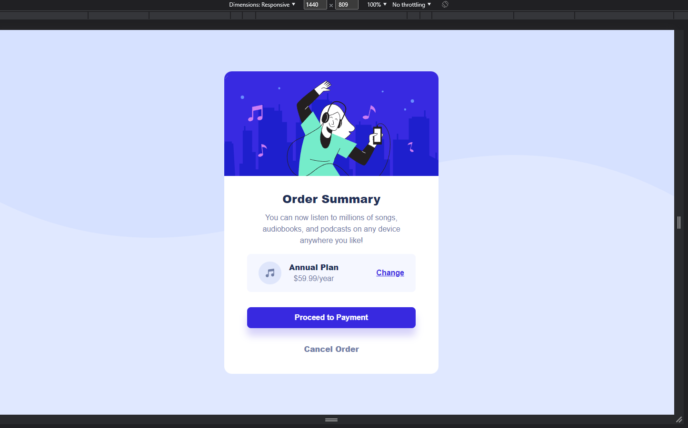

# Frontend Mentor - Order summary card solution

This is a solution to the [Order summary card challenge on Frontend Mentor](https://www.frontendmentor.io/challenges/order-summary-component-QlPmajDUj). Frontend Mentor challenges help you improve your coding skills by building realistic projects. 

## Overview

I am 100% beginner. You'll see that when you look at my code. Hehe Although I am a beginner, this is the first project that I've ever completed just by myself. I think, I finally stepped out from 'tutorial hell' and my 'comfort zone'.

### The challenge

Users should be able to:

- See hover states for interactive elements

### Screenshot

### Links

- Live Site URL: [Netlify](https://sage-licorice-9f710c.netlify.app)

## My process

Just straightforward building process from a person who is totally a beginner.

### Built with

- HTML5
- Flexbox

### Useful resources

- [Resource 1](https://www.w3schools.com/) - The classic. Amazing resource for everything that related to coding.
- [Resource 2](https://www.example.com) - As the name says, I use it for converting units (px to rem)

## Author

- Frontend Mentor - [@egolam](https://www.frontendmentor.io/profile/egolam)
- Twitter - [@robot4qbu](https://www.twitter.com/robot4qbu)